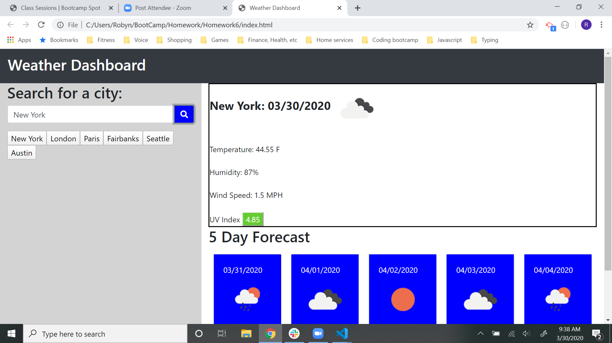

# Homework6

# 06 Server-Side APIs: Weather Dashboard

## User Story

```
AS A traveler
I WANT to see the weather outlook for multiple cities
SO THAT I can plan a trip accordingly
```
## Description

This application is a dashboard to display weather data.  The user can search for a city name.  Weather data for that city is then displayed for both the current day and a five day forecast.  The current day provides temperature in fahrenheit, humidity, wind speed and UV index.  The UV index is in a color coded block indicating the severity.  All dates also display an icon showing the cloud/precipitation conditions.  Finally, all searched cities are retained in buttons displayed underneath the search bar to be able to quickly search the same city again.

## Completed

```
* Search bar for city name with each search history displayed as individual button that can be clicked to search that city again
* Current day card displays the city name, date, a weather condition icon, temperature, humidity, wind speed, and UV index
* UV index is displayed in button color coded based on severity
* Five day forecast data is displayed in separate card with the date, weather condition icon, temperature, and humidity
* All funcitonality was tested and HTML was validated
```

## Application URL

https://robynp108.github.io/Homework6/

## Application Screenshot




